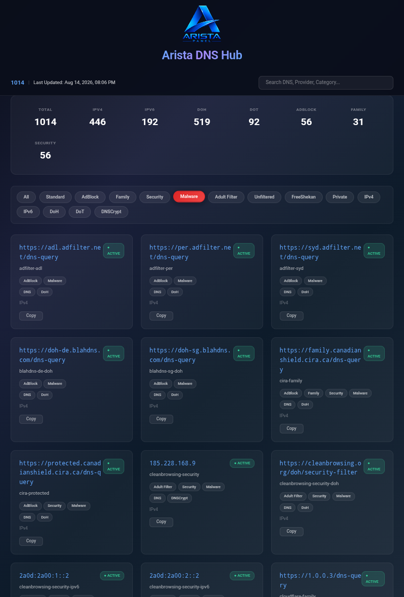

# Arista DNS Hub

### سامانه جمع‌آوری، استخراج، تست و تحلیل DNS

سامانه‌ای برای جمع‌آوری، استخراج، بررسی، تحلیل، دسته‌بندی و انتشار DNSهای عمومی

 

---

## 🌐 لینک‌های پروژه

### 📦 جمع‌آوری کانفیگ‌ها

پروژه مربوط به جمع‌آوری، استخراج و پردازش کانفیگ‌ها.

---

### 🌍 وب Arista DNS

---

## 📖 درباره پروژه

**Arista DNS Hub** یک سامانه برای جمع‌آوری و مدیریت DNSهای عمومی از منابع مختلف است.

هدف پروژه ایجاد یک پایگاه داده جامع، مرتب و قابل جست‌وجو از DNSهای مختلف است؛ به‌طوری که DNSهای استخراج‌شده پس از جمع‌آوری، بررسی، تحلیل، دسته‌بندی و در نهایت در رابط وب پروژه منتشر شوند.

فرآیند اصلی پروژه شامل:

**جمع‌آوری → استخراج → تشخیص → تحلیل → تست → حذف تکراری → دسته‌بندی → انتشار**

است.

---

## 🚀 قابلیت‌ها

- 🔎 جمع‌آوری DNS از منابع عمومی
- 📥 استخراج خودکار DNS
- 🌐 پشتیبانی از DNS over HTTPS
- 🔐 پشتیبانی از DNS over TLS
- 🌍 پشتیبانی از IPv4
- 🌎 پشتیبانی از IPv6
- 🔌 شناسایی DNSهای دارای پورت
- 🧩 شناسایی DNSهای بدون پورت
- 🏷️ دسته‌بندی DNSها
- 🛡️ شناسایی DNSهای AdBlock
- 👨‍👩‍👧 شناسایی DNSهای Family
- 🔒 شناسایی DNSهای Security
- 🦠 شناسایی DNSهای Malware
- 🔞 شناسایی Adult Filter
- 🚫 شناسایی DNSهای Unfiltered
- ⚡ تست و بررسی DNSها
- 📊 تولید آمار
- 🔍 جست‌وجوی DNS
- 🧹 حذف موارد تکراری
- 📦 تولید خروجی JSON
- 🔄 بروزرسانی خودکار داده‌ها
- 📱 رابط کاربری سازگار با موبایل
- 🖥️ رابط کاربری مدرن و شیشه‌ای
- ☁️ انتشار روی GitHub Pages
- ⚡ انتشار روی Cloudflare Workers

---

## 🧠 اصل مهم استخراج DNS

یکی از مهم‌ترین اصول Arista DNS این است که **مقدار استخراج‌شده نباید توسط استخراج‌کننده تغییر کند.**

اگر DNS در منبع به شکل زیر باشد:

    dns.example.com

همان مقدار استخراج می‌شود.

اگر در منبع به شکل زیر باشد:

    dns.example.com:853

پورت **853 حفظ می‌شود**.

اگر در منبع به شکل زیر باشد:

    tls://dns.example.com

همان فرمت حفظ می‌شود.

اگر در منبع به شکل زیر باشد:

    tls://dns.example.com:853

هم Host و هم پورت و هم ساختار اصلی حفظ می‌شوند.

برای DoH نیز URL اصلی حفظ می‌شود.

مثلاً:

    https://dns.example.com/dns-query

بدون تغییر وارد داده‌های پروژه می‌شود.

---

## ⛔ هیچ تغییر مصنوعی روی DNS انجام نمی‌شود

استخراج‌کننده نباید برای DNS استخراج‌شده:

- پورت اضافه کند
- پورت حذف کند
- پورت را تغییر دهد
- `:853` را به DNS بدون پورت اضافه کند
- لینک را کوتاه کند
- URL را بازنویسی کند
- Scheme را تغییر دهد
- مسیر URL را تغییر دهد
- Host را تغییر دهد
- DNS را به فرمت دیگری تبدیل کند
- مقدار اصلی را حدس بزند
- مقدار استخراج‌شده را بازسازی کند

قاعده ساده است:

> **هر چیزی که در منبع وجود دارد، همان چیزی است که باید استخراج شود.**

وجود پورت یا عدم وجود پورت نیز بخشی از اطلاعات اصلی DNS است.

---

## 🔐 پروتکل‌های مورد بررسی

### DNS over HTTPS — DoH

نمونه:

    https://dns.example.com/dns-query

اطلاعات URL اصلی DNS حفظ می‌شود.

### DNS over TLS — DoT

نمونه بدون پورت:

    tls://dns.example.com

نمونه دارای پورت:

    tls://dns.example.com:853

در هر دو حالت مقدار اصلی منبع حفظ می‌شود.

---

## 🧪 تست و تحلیل

DNSهای استخراج‌شده می‌توانند در مراحل مختلف مورد بررسی قرار بگیرند.

موارد مورد بررسی می‌تواند شامل:

- معتبر بودن ساختار DNS
- معتبر بودن Host
- تشخیص IPv4
- تشخیص IPv6
- تشخیص DoH
- تشخیص DoT
- شناسایی پورت
- بررسی دسترسی‌پذیری
- بررسی Endpoint
- بررسی پاسخ DNS
- تحلیل وضعیت DNS
- دسته‌بندی DNS
- بررسی قابلیت استفاده

باشد.

---

## 🏷️ دسته‌بندی DNSها

DNSها بر اساس اطلاعات موجود در منابع در دسته‌های مختلف قرار می‌گیرند.

### دسته‌های عمومی

- Standard
- Private
- Unfiltered

### دسته‌های امنیتی

- Security
- Malware
- AdBlock

### دسته‌های خانوادگی

- Family
- Adult Filter

### پروتکل‌ها

- DoH
- DoT
- DNSCrypt

### نوع آدرس

- IPv4
- IPv6

---

## 🔄 بروزرسانی خودکار

داده‌های پروژه از منابع مشخص‌شده جمع‌آوری شده و پس از پردازش، خروجی جدید تولید می‌شود.

روند کلی:

    منابع عمومی
         ↓
    جمع‌آوری اطلاعات
         ↓
    استخراج DNS
         ↓
    تشخیص نوع و پروتکل
         ↓
    تحلیل اطلاعات
         ↓
    حذف Duplicate واقعی
         ↓
    تست و بررسی
         ↓
    دسته‌بندی
         ↓
    تولید JSON
         ↓
    انتشار در Arista DNS Hub

---

## 🧹 حذف DNSهای تکراری

پروژه برای جلوگیری از ایجاد رکوردهای تکراری، DNSهای استخراج‌شده را بررسی می‌کند.

اما تشخیص تکراری بودن نباید باعث تغییر اطلاعات اصلی DNS شود.

برای مثال:

    dns.example.com

و:

    dns.example.com:853

به دلیل تفاوت در مقدار اصلی، نباید صرفاً بر اساس شباهت Host یکی در نظر گرفته شوند.

هدف:

> حذف Duplicate واقعی، بدون حذف یا تغییر DNSهای معتبر.

---

## 📦 ساختار داده

اطلاعات DNSها در قالب JSON ذخیره می‌شوند.

نمونه اطلاعات DoH:

    {
      "provider": "Example DNS",
      "doh_url": "https://dns.example.com/dns-query",
      "address": "dns.example.com",
      "name": "Example DNS",
      "source": "curl",
      "type": "DoH",
      "hostname": "dns.example.com",
      "path": "/dns-query",
      "protocol": "DoH"
    }

نمونه اطلاعات DoT:

    {
      "provider": "Example DNS",
      "address": "dns.example.com",
      "name": "Example DNS",
      "source": "curl",
      "type": "DoT",
      "hostname": "dns.example.com",
      "protocol": "DoT",
      "dot": "tls://dns.example.com:853"
    }

---

## 📊 آمار

Arista DNS اطلاعات آماری مختلفی از داده‌های جمع‌آوری‌شده ارائه می‌کند.

از جمله:

- تعداد کل DNSها
- تعداد IPv4
- تعداد IPv6
- تعداد DoH
- تعداد DoT
- تعداد AdBlock
- تعداد Family
- تعداد Security

آمار پس از بروزرسانی داده‌ها قابل مشاهده خواهد بود.

---

## 🔍 جست‌وجو

رابط وب پروژه امکان جست‌وجوی DNSها را فراهم می‌کند.

جست‌وجو می‌تواند بر اساس اطلاعات مختلفی مانند:

- آدرس
- Provider
- نام DNS
- Hostname
- URL
- نوع DNS
- پروتکل
- دسته‌بندی

انجام شود.

---

## 📱 رابط وب

رابط کاربری Arista DNS با تمرکز بر سادگی، سرعت و دسترسی مناسب طراحی شده است.

ویژگی‌های رابط:

- طراحی مدرن
- رابط شیشه‌ای
- نمایش کارت‌های DNS
- جست‌وجوی سریع
- فیلتر بر اساس نوع
- فیلتر بر اساس پروتکل
- فیلتر بر اساس دسته‌بندی
- نمایش آمار
- صفحه‌بندی
- کپی سریع DNS
- سازگاری با موبایل
- سازگاری با دسکتاپ

---

## 🌐 نسخه‌های وب

### GitHub Pages

نسخه میزبانی‌شده روی GitHub Pages:

### Cloudflare Workers

نسخه میزبانی‌شده روی Cloudflare Workers:

---

## 📦 پروژه مرتبط

### AriataPanel

بخش جمع‌آوری کانفیگ‌ها در پروژه AriataPanel قرار دارد.

---

## 🛠️ فناوری‌ها

پروژه با استفاده از فناوری‌ها و ابزارهای مختلف توسعه داده شده است:

- Python
- JavaScript
- HTML
- CSS
- JSON
- Requests
- BeautifulSoup
- GitHub Actions
- GitHub Pages
- Cloudflare Workers

---

## 📁 ساختار پروژه

    AristaDns/
    │
    ├── assets/
    │   └── logo/
    │       └── readme.png
    │
    ├── data/
    │   ├── dns.json
    │   └── stats.json
    │
    ├── parsers/
    │
    ├── scripts/
    │
    ├── index.html
    ├── style.css
    ├── script.js
    └── README.md

ساختار پروژه با توسعه قابلیت‌های جدید ممکن است تغییر کند.

---

## 🎯 هدف نهایی

هدف Arista DNS ایجاد یک مرجع جامع برای DNSهای عمومی و فراهم کردن دسترسی ساده و سریع به DNSهای مختلف است.

پروژه تلاش می‌کند تمام مراحل را به شکل خودکار انجام دهد:

**جمع‌آوری**

↓

**استخراج**

↓

**تشخیص**

↓

**تحلیل**

↓

**تست**

↓

**دسته‌بندی**

↓

**حذف موارد تکراری**

↓

**تولید داده**

↓

**انتشار**

---

## ⚠️ توجه

DNSهای موجود در این پروژه از منابع عمومی جمع‌آوری می‌شوند.

فعال بودن، سرعت و کیفیت DNSها ممکن است در طول زمان تغییر کند.

قرار گرفتن یک DNS در پایگاه داده به معنی تضمین دائمی عملکرد آن نیست.

---

## 👨‍💻 توسعه‌دهنده

### توسعه‌دهنده: تیم آریستا❤️

